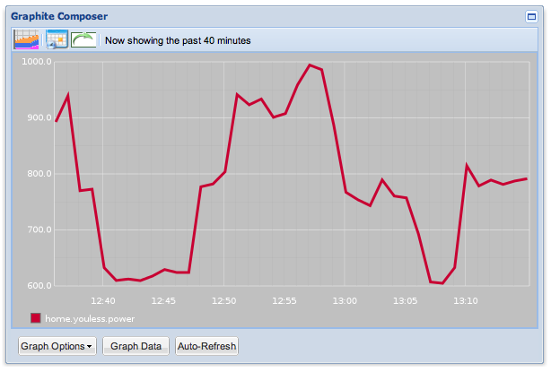

# mqtt2graphite

This program subscribes to any number of MQTT topics, extracts a value from the
messages' payload and sends that off to [Graphite][1] via [Carbon][2] over a UDP
socket. 

Values in the payload can be simple numbers (`92`, `12.7`) or [JSON][3] strings.
In the latter case, all JSON names/keys are extracted and if their values are 
numeric, these are then sent off to Carbon (see example below)



## Requirements

* [Paho Python MQTT](https://pypi.python.org/pypi/paho-mqtt)
* A running Carbon/Graphite server with UDP-enabled reception
* Access to an MQTT broker. (I use [Mosquitto](http://mosquitto.org/))

## Installation and Configuration

* Configure the mqtt2graphite init script

```bash
pip install git+https://github.com/jpmens/mqtt2graphite.git
./init_server.sh mqtt.hostname
```

## Running

* Edit the `mqtt.hostname.conf` file
* Run or add this cmd `supervisord -c /etc/supervisord.conf` in your /etc/rc.local

## Handling numeric payloads

_mqtt2graphite_ assumes topics defined as `"n"` in the _map_ file contain a simple
number (integer or float), published thusly:

```
mosquitto_pub  -t test/jp/j1 -m '69'
```

## Handling JSON payloads

```
mosquitto_pub  -t test/jp/j2 -m '{ "size":69,"temp": 89.3, "gas": " 88", "name": "JP Mens" }'
```

produces the following Carbon keys

```
test.jp.j2.gas 88.000000 1363169282
test.jp.j2.temp 89.300000 1363169282
test.jp.j2.size 69.000000 1363169282
```

## Todo

A lot. 

* Add configuration file in which we specify username/password and TLS certificates.
* I'm not experienced enough with high volume of messages, so this should maybe
  transmit to Carbon via StatsD?

  [1]: http://graphite.wikidot.com/
  [2]: http://graphite.wikidot.com/carbon
  [3]: http://json.org
